# 🙌 미니 프로젝트 숙박 예약 서비스 🙌

## 프로젝트 기간

■ 기간

- 2024.06.17 - 2024.07.05, 3주간

■ 참여인원

- FE 3명, BE 5명

---

## 👥팀원 구성

|                                                                                                                                                                               **김재민**                                                                                                                                                                                |                                                                                                                                                                             **이상권 (팀장)**                                                                                                                                                                             |                                                                                                                                                                               **천문기**                                                                                                                                                                                |                                                                                                                                                                                **하정훈**                                                                                                                                                                                |                                                                                                        **한보름**                                                                                                         |
|:--------------------------------------------------------------------------------------------------------------------------------------------------------------------------------------------------------------------------------------------------------------------------------------------------------------------------------------------------------------------:|:--------------------------------------------------------------------------------------------------------------------------------------------------------------------------------------------------------------------------------------------------------------------------------------------------------------------------------------------------------------------:|:--------------------------------------------------------------------------------------------------------------------------------------------------------------------------------------------------------------------------------------------------------------------------------------------------------------------------------------------------------------------:|:---------------------------------------------------------------------------------------------------------------------------------------------------------------------------------------------------------------------------------------------------------------------------------------------------------------------------------------------------------------------:|:----------------------------------------------------------------------------------------------------------------------------------------------------------------------------------------------------------------------:|
|                                                                                                                                                                         숙소, 좋아요, 로그, 이메일 알림                                                                                                                                                                          |                                                                                                                                                                                CI/CD                                                                                                                                                                                 |                                                                                                                                                                              예약하기, 예약조회                                                                                                                                                                              |                                                                                                                                                                       회원, 회원 가입, 로그인, Security                                                                                                                                                                        |                                                                                                        객실, 홍일점                                                                                                         |
|  |  |  |  |  |

---

## 🧱 아키텍쳐

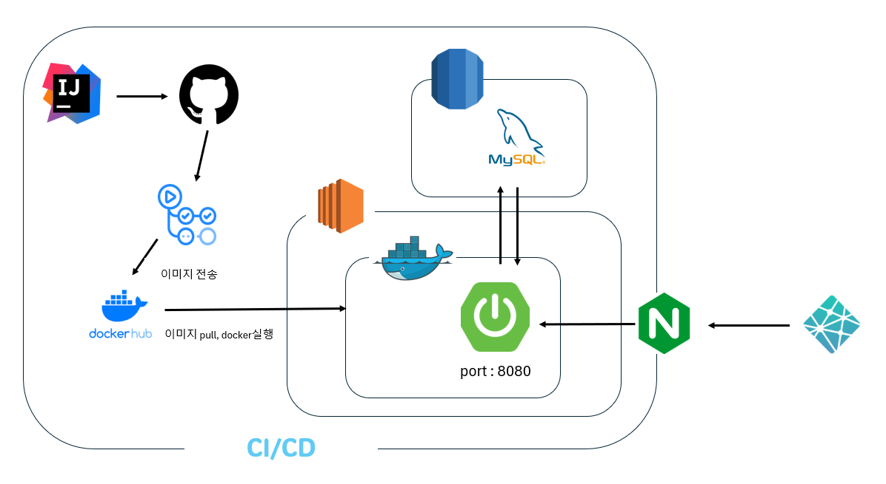

---

## 구현 내용

- ■ [요구사항](https://drive.google.com/file/d/1A6jWwX5rhc4_OXAa8RYKm9JgU7vzTmiR/view?usp=sharing) 필수 기능
    - 회원
        - 회원 가입, 로그인
    - 숙소
        - 카테고리 별 숙소 조회
    - 객실
        - 객실 전체 조회
        - 객실 상세 조회
    - 예약
        - 예약하기
        - 예약 내역 조회
- 예약 시 이메일 전송 서비스
- 좋아요, 좋아요 목록 조회

---

## 🔨기술 스택 및 도구

- **■ Develop**
    - Java 17
    - Spring boot 3.3.0
    - MySQL
    - Spring security
    - Java-jwt
    - Swagger


- **■ Test**
    - Junit
    - mockito
    - h2

---

## ERD

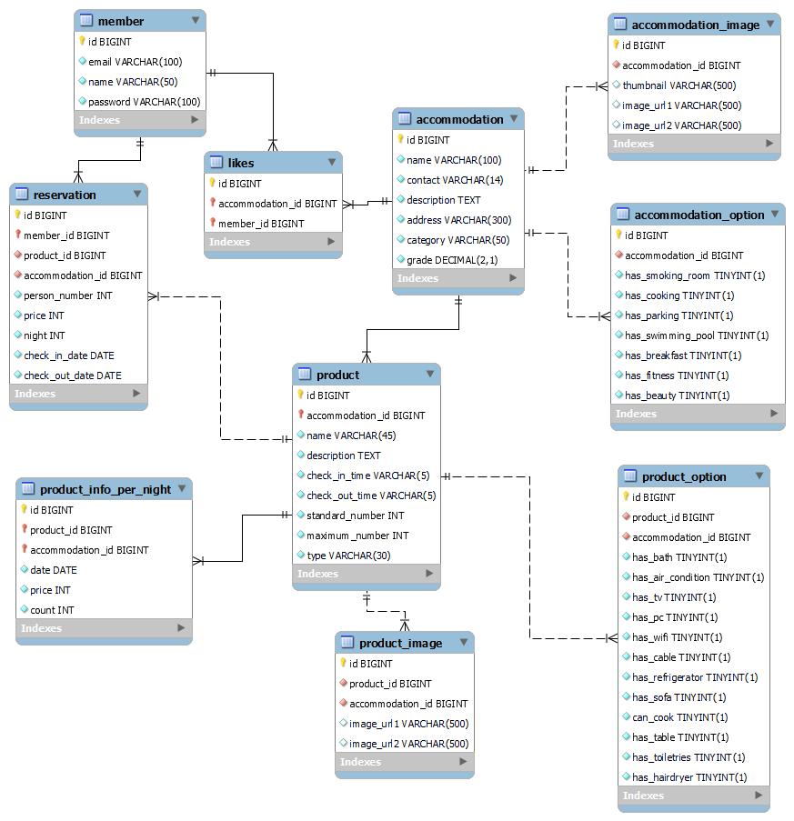

---

## API List

- ### [swagger](http://15.165.4.237/swagger-ui/index.html#/)

- ### API List

  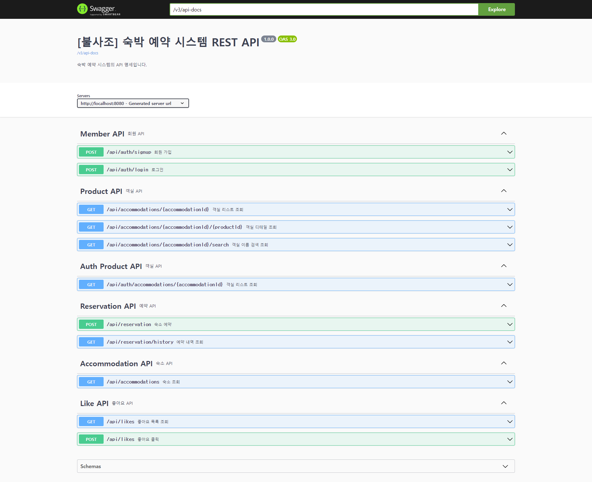

---

## 결과물

- **구현 사이트** : [wanderlust](https://wanderlust-mini4.netlify.app/)

---

### ■ 회원 가입

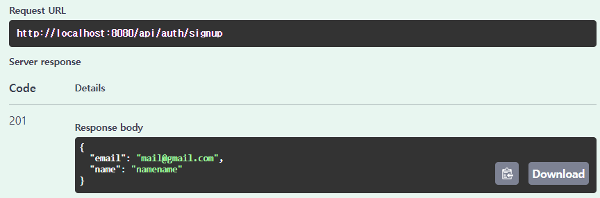

### ■ 로그인

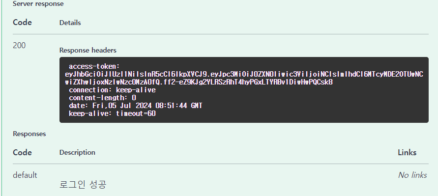

### ■ 숙소 조회

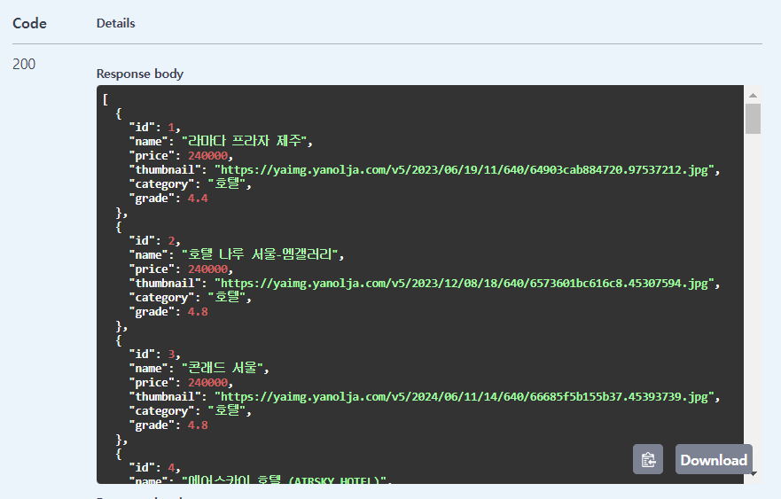

### ■ 객실 리스트 조회

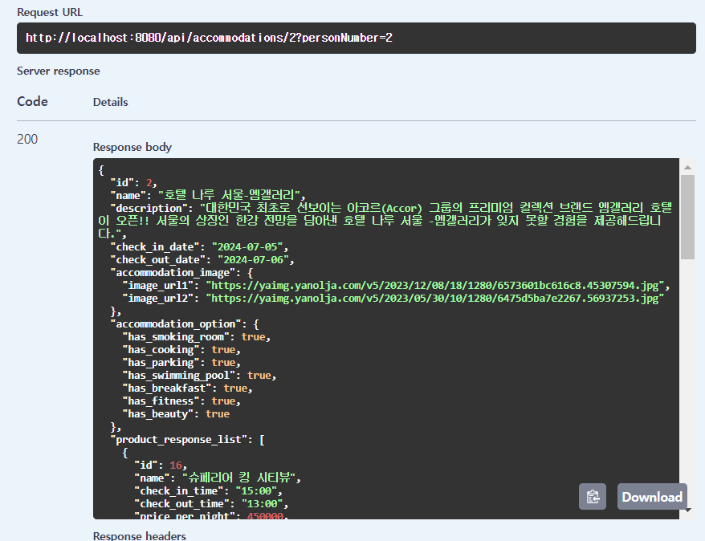

### ■ 객실 상세 조회


### ■ 좋아요 클릭

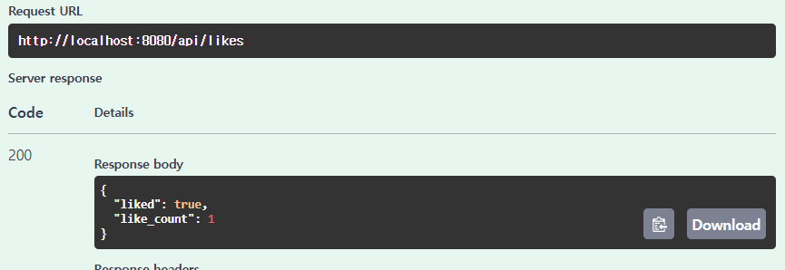

### ■ 좋아요 목록 조회

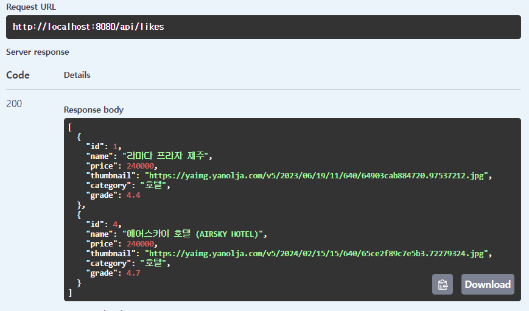

### ■ 예약하기

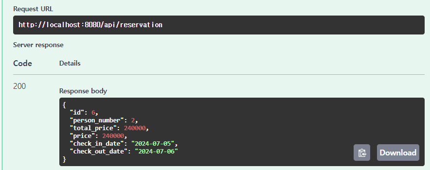

### ■ 이메일 알림

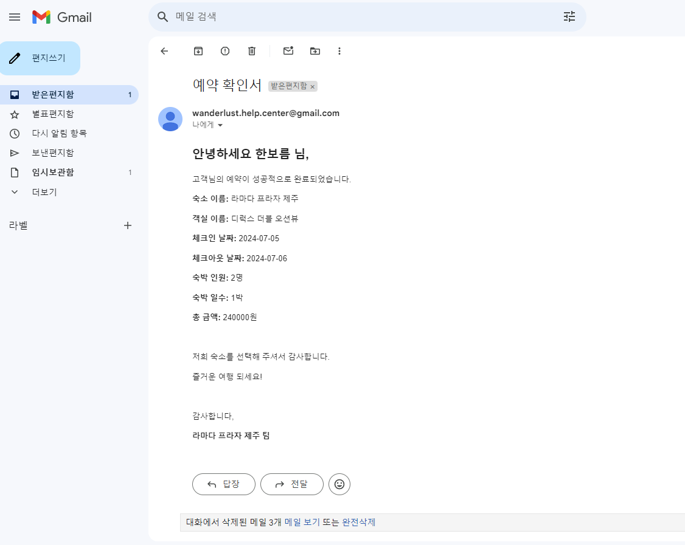

### ■ 예약 내역 조회

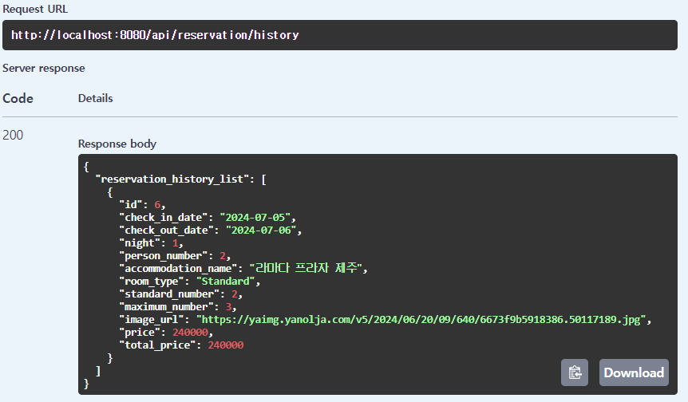

### ■ 로그


---

## Directory Structure

```bash
Project
│  .gitignore
│  build.gradle
│  Dockerfile
│  gradlew
│  gradlew.bat
│  README.md
│  settings.gradle
│
├─.github
│  └─workflows
│          ci.yml
│          deploy.yml
│
├─.gradle
│  ├─8.8
│  │  │  gc.properties
│  │  │
│  │  ├─checksums
│  │  │      checksums.lock
│  │  │
│  │  ├─dependencies-accessors
│  │  │      gc.properties
│  │  │
│  │  ├─executionHistory
│  │  │      executionHistory.lock
│  │  │
│  │  ├─expanded
│  │  ├─fileChanges
│  │  │      last-build.bin
│  │  │
│  │  ├─fileHashes
│  │  │      fileHashes.lock
│  │  │
│  │  └─vcsMetadata
│  ├─buildOutputCleanup
│  │      buildOutputCleanup.lock
│  │      cache.properties
│  │
│  └─vcs-1
│          gc.properties
│
├─.idea
│  │  .name
│  │  compiler.xml
│  │  gradle.xml
│  │  jarRepositories.xml
│  │  jpa.xml
│  │  misc.xml
│  │  modules.xml
│  │  vcs.xml
│  │  workspace.xml
│  │
│  └─modules
│          Travel-Mini.main.iml
│
├─gradle
│  └─wrapper
│          gradle-wrapper.jar
│          gradle-wrapper.properties
│
└─src
    ├─main
    │  ├─java
    │  │  └─com
    │  │      └─travel
    │  │          │  KdtBe8MiniProjectApplication.java
    │  │          │
    │  │          ├─domain
    │  │          │  ├─accommodation
    │  │          │  │  ├─controller
    │  │          │  │  │      AccommodationController.java
    │  │          │  │  │
    │  │          │  │  ├─dto
    │  │          │  │  │  └─response
    │  │          │  │  │          AccommodationDetailListResponse.java
    │  │          │  │  │          AccommodationImageResponse.java
    │  │          │  │  │          AccommodationOptionResponse.java
    │  │          │  │  │          AccommodationResponse.java
    │  │          │  │  │
    │  │          │  │  ├─entity
    │  │          │  │  │      Accommodation.java
    │  │          │  │  │      AccommodationImage.java
    │  │          │  │  │      AccommodationOption.java
    │  │          │  │  │
    │  │          │  │  ├─repository
    │  │          │  │  │      AccommodationRepository.java
    │  │          │  │  │
    │  │          │  │  └─service
    │  │          │  │          AccommodationService.java
    │  │          │  │
    │  │          │  ├─email
    │  │          │  │  └─service
    │  │          │  │          EmailService.java
    │  │          │  │
    │  │          │  ├─like
    │  │          │  │  ├─controller
    │  │          │  │  │      LikeController.java
    │  │          │  │  │
    │  │          │  │  ├─dto
    │  │          │  │  │  ├─request
    │  │          │  │  │  │      LikeRequest.java
    │  │          │  │  │  │
    │  │          │  │  │  └─response
    │  │          │  │  │          LikeResponse.java
    │  │          │  │  │
    │  │          │  │  ├─entity
    │  │          │  │  │      Like.java
    │  │          │  │  │
    │  │          │  │  ├─repository
    │  │          │  │  │      LikeRepository.java
    │  │          │  │  │
    │  │          │  │  └─service
    │  │          │  │          LikeService.java
    │  │          │  │
    │  │          │  ├─member
    │  │          │  │  ├─controller
    │  │          │  │  │      MemberController.java
    │  │          │  │  │
    │  │          │  │  ├─dto
    │  │          │  │  │  ├─request
    │  │          │  │  │  │      LoginRequest.java
    │  │          │  │  │  │      SignupRequest.java
    │  │          │  │  │  │
    │  │          │  │  │  └─response
    │  │          │  │  │          LoginDto.java
    │  │          │  │  │          LoginResponse.java
    │  │          │  │  │          MemberResponse.java
    │  │          │  │  │
    │  │          │  │  ├─entity
    │  │          │  │  │      Member.java
    │  │          │  │  │
    │  │          │  │  ├─repository
    │  │          │  │  │      MemberRepository.java
    │  │          │  │  │
    │  │          │  │  └─service
    │  │          │  │          MemberService.java
    │  │          │  │
    │  │          │  ├─product
    │  │          │  │  ├─controller
    │  │          │  │  │      AuthProductController.java
    │  │          │  │  │      ProductController.java
    │  │          │  │  │
    │  │          │  │  ├─dto
    │  │          │  │  │  └─response
    │  │          │  │  │          ProductDetailResponse.java
    │  │          │  │  │          ProductImageResponse.java
    │  │          │  │  │          ProductOptionResponse.java
    │  │          │  │  │          ProductResponse.java
    │  │          │  │  │          ProductSimpleResponse.java
    │  │          │  │  │
    │  │          │  │  ├─entity
    │  │          │  │  │      Product.java
    │  │          │  │  │      ProductImage.java
    │  │          │  │  │      ProductInfoPerNight.java
    │  │          │  │  │      ProductOption.java
    │  │          │  │  │
    │  │          │  │  ├─repository
    │  │          │  │  │      ProductInfoPerNightRepository.java
    │  │          │  │  │      ProductRepository.java
    │  │          │  │  │
    │  │          │  │  └─service
    │  │          │  │          ProductService.java
    │  │          │  │
    │  │          │  └─reservations
    │  │          │      ├─controller
    │  │          │      │      ReservationController.java
    │  │          │      │
    │  │          │      ├─dto
    │  │          │      │  ├─request
    │  │          │      │  │      ReservationRequest.java
    │  │          │      │  │
    │  │          │      │  └─response
    │  │          │      │          ReservationHistoryListResponse.java
    │  │          │      │          ReservationHistoryResponse.java
    │  │          │      │          ReservationResponse.java
    │  │          │      │
    │  │          │      ├─entity
    │  │          │      │      Reservation.java
    │  │          │      │
    │  │          │      ├─repository
    │  │          │      │      ReservationRepository.java
    │  │          │      │
    │  │          │      └─service
    │  │          │              ReservationService.java
    │  │          │
    │  │          └─global
    │  │              ├─annotation
    │  │              │      TokenMemberId.java
    │  │              │
    │  │              ├─aspect
    │  │              │      LoggingAspect.java
    │  │              │
    │  │              ├─config
    │  │              │      AsyncConfig.java
    │  │              │      CacheConfig.java
    │  │              │      ObjectMapperConfig.java
    │  │              │      SecurityConfig.java
    │  │              │      SwaggerConfig.java
    │  │              │      WebConfig.java
    │  │              │
    │  │              ├─decorator
    │  │              │      MailTaskDecorator.java
    │  │              │
    │  │              ├─exception
    │  │              │  │  AccommodationException.java
    │  │              │  │  AuthException.java
    │  │              │  │  EmailException.java
    │  │              │  │  MemberException.java
    │  │              │  │  ProductException.java
    │  │              │  │  ReservationsException.java
    │  │              │  │
    │  │              │  ├─handler
    │  │              │  │      AsyncExceptionHandler.java
    │  │              │  │      GlobalExceptionHandler.java
    │  │              │  │      TravelApiExceptionHandler.java
    │  │              │  │
    │  │              │  └─type
    │  │              │          ErrorType.java
    │  │              │
    │  │              ├─interceptor
    │  │              │      AuthorizationInterceptor.java
    │  │              │
    │  │              ├─jwt
    │  │              │      JwtProvider.java
    │  │              │      JwtTokenUtility.java
    │  │              │
    │  │              ├─model
    │  │              │  └─entity
    │  │              │          TimeStamp.java
    │  │              │
    │  │              ├─resolver
    │  │              │      TokenMemberIdResolver.java
    │  │              │
    │  │              └─util
    │  │                      DateValidationUtil.java
    │  │
    │  └─resources
    │      │  application-prod.yml
    │      │  application.yml
    │      │  logback-spring-dev.xml
    │      │  logback-spring-prod.xml
    │      │  logback-spring.xml
    │      │
    │      └─templates
    │              reservation-confirmation.html
    │
    └─test
        ├─java
        │  └─com
        │      └─travel
        │          │  KdtBe8MiniProjectApplicationTests.java
        │          │
        │          ├─domain
        │          │  ├─accommodation
        │          │  │  ├─controller
        │          │  │  │      AccommodationControllerTest.java
        │          │  │  │
        │          │  │  ├─repository
        │          │  │  │      AccommodationRepositoryTest.java
        │          │  │  │
        │          │  │  └─service
        │          │  │          AccommodationServiceTest.java
        │          │  │
        │          │  ├─like
        │          │  │  ├─controller
        │          │  │  │      LikeControllerTest.java
        │          │  │  │
        │          │  │  ├─repository
        │          │  │  │      LikeRepositoryTest.java
        │          │  │  │
        │          │  │  └─service
        │          │  │          LikeServiceTest.java
        │          │  │
        │          │  ├─member
        │          │  │  ├─controller
        │          │  │  │      MemberControllerTest.java
        │          │  │  │
        │          │  │  ├─repository
        │          │  │  │      MemberRepositoryTest.java
        │          │  │  │
        │          │  │  └─service
        │          │  │          MemberServiceTest.java
        │          │  │
        │          │  ├─product
        │          │  │  ├─controller
        │          │  │  │      ProductControllerTest.java
        │          │  │  │
        │          │  │  ├─repository
        │          │  │  │      ProductInfoPerNightRepositoryTest.java
        │          │  │  │      ProductRepositoryTest.java
        │          │  │  │
        │          │  │  └─service
        │          │  │          ProductServiceTest.java
        │          │  │
        │          │  └─reservations
        │          │      ├─controller
        │          │      │      ReservationControllerTest.java
        │          │      │
        │          │      ├─repository
        │          │      │      ReservationRepositoryTest.java
        │          │      │
        │          │      └─service
        │          │              ReservationServiceTest.java
        │          │
        │          └─script
        │                  concurrentTest.js
        │                  script.js
        │
        └─resources
                application.yml

```

# 트러블 슈팅

### 이메일 전송 속도

- 동기 방식으로 이메일 전송 시 1건당 약 6초의 소요시간 발생
    - @Async을 통해 비동기 방식으로 변경하여 약 1초대로 단축 (약 83.33%)

  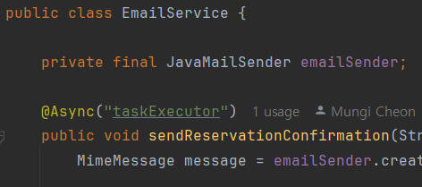

    - 수정 전
      

    - 수정 후
      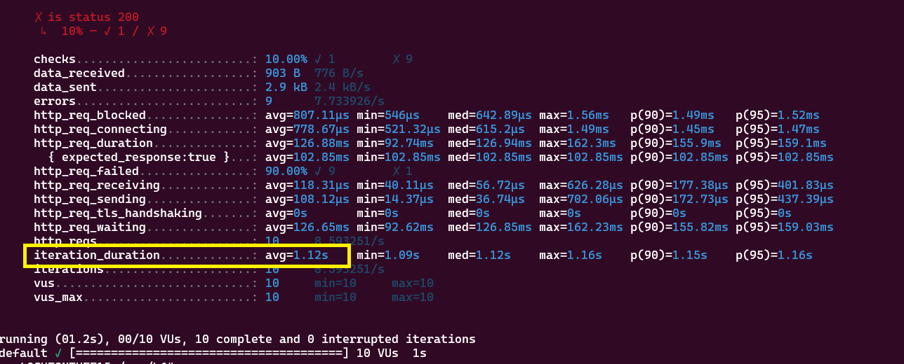

---

### 숙소 조회 N+1

- Fetch Join + Lazy + BatchSize 로 쿼리문 단축 → BatchSize 어노테이션을 사용하면 오히려 성능이 저하되는 이슈가 발생.
    - 이유는 모든 숙소의 데이터를 다 가져오게되어 불필요한 쿼리가 추가됨
    - accommodation 엔티티에서 BatchSize 어노테이션을 제거하여 해결

      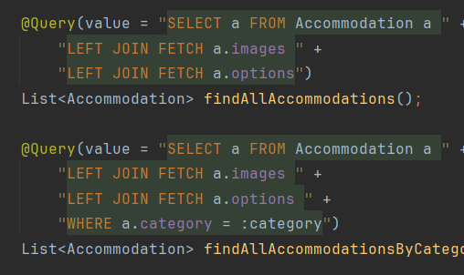

      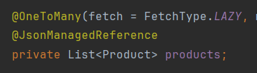

- 성능문제
    - 캐싱 → 인메모리 데이터베이스에 캐싱하여 조회 속도를 개선
      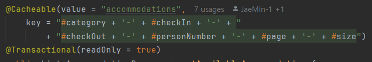
